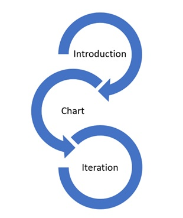

# Narrrative visualization with D3.js

CS 416: Data Visualization
University of Illinois Urbana Champaign - Summer, 2021
Autor: Pericles Rocha

Demo: https://periclesrocha.github.io/2018.html

Table of contents:

1. [Introduction](#introduction)
2. [Messaging](#Messaging)
3. [Narrative structure](#Narrative_structure)
4. [Visual structure](#Visual_structure)
5. [Scenes](#Scenes)
6. [Annotations](#Annotations)
7. [Parameters](#Parameters)
8. [Triggers](#Triggers)
9. [Conclusion](#Conclusion)

## Introduction 
This project communicates to readers, using a visual narrative, the recent rise of house prices in Austin (Texas) and its metropolitan area. Austin is regarded as one of the hottest housing markets in America today and considered a thermometer to the rest of the country. For someone looking to buy or sell a house, the trends in Austin can help them understand if this is the right moment for such an important decision.

We’ll look at historical data compiled by researchers for a Kaggle article. The article in question can be found on https://www.kaggle.com/ericpierce/austinhousingprices. The dataset originates from the real state website redfin.com (or simply put “Redfin”) and includes over 40 features that help describe the houses in question. For this study, we only looked at the city of the property, the year of a sale operation, and the sale price reported on Redfin.
The narrative visualization described in this document can be found on https://periclesrocha.github.io/index.html. 

## Messaging 
With the COVID-19 pandemic, workers are considering if they can continue working from home or if they’ll need to get back to their offices. While some companies have stated that they expect their employees to be back in the office[^1], several others have gone the opposite way[^2] and shifted to flexible work terms. This had an undeniable impact on the housing market, as people learned that they could move to cheaper areas in the suburbs of capitals where they can afford better homes, farther away from their work. But is the COVID-19 pandemic really the driver behind the rise in home prices?

The messaging I am trying to communicate through this narrative visualization is that house prices have been increasing in the past few years, regardless of the COVID-19 pandemic. By looking at the housing market in the Austin metropolitan area, we look at a trend in home prices and how some regions can be overly priced regardless of the average of other properties in the same region.

## Narrative structure 
This narrative visualization follows an interactive slide show structure. After consideration, the decision for this structure came from the fact that it was just simpler to communicate and consume the data when we looked at one year at a time. I’ve considered other structures as well and, in fact, at first, I wanted to pivot in each city and tell the story about the rise in prices over the years for that one city. However, that would give us up to eight different scenes, one for each city, which would make the consumption of the report less seamless.

Through the narrative, the reader is invited to first read the introduction, then glance at the chart, and then look at the data for each city on each year. 

This last step runs in a loop, as the reader looks at the chart, consults with tooltips, and then flips through the years. Each year consists of a scene on this narrative visualization. 

## Visual structure 
The visual structure consists of the use of bar charts, which are optimal for quantitative data. It uses the mean home sale price for the height of the chart, and each city or metropolitan area consisting of a category, having their own bar. The categorical axis (the x-axis) is ordered alphabetically to make it easy to find a city when needed.

Bar charts make it easy for the viewer to focus on the important parts of the data, as it’s natural compare values in between cities. Also, annotations help drive attention where it deserves.

In fact, bar charts not only help compare the price between cities, but also the difference in the mean price over the years when different scenes are selected, as the chart remains in the same place, regardless of the navigational method utilized (each scene is a different html page). This is important to help the reader understand how the data in one scene connects to the data on the other scenes. 

## Scenes 
The scenes on this narrative visualization represent the year for the mean home sale price for each city. There are three scenes: 2018, 2019 and 2020. They are ordered numerically, in ascending order, to help the reader navigate and see the evolution of the home sale prices over the years. 

## Annotations 
The annotations template used for this narrative visualization is Susie Lu’s annotation template for D3 (https://d3-annotation.susielu.com/). This annotations template was chosen due to simplicity and for being a visually attractive annotation template for bar charts. It also shows a modern way to drive attention to the data point that we’re trying to highlight, offers a bold subtitle for that annotation, and some room for a quick description. In summary: it is elegant and simple to use.

Annotation don’t change within a given scene. Rather, each scene contains one single annotation to help highlight what seems relevant about this scene, with a quick explanation. For example: my third scene, 2020, shows that the median price for houses for West Lake Hills is way above the average for all other cities in the Austin metropolitan area, but how could that be? Annotations make it possible to inform the reader that this was a single house reported as sold that year on that city.

## Parameters 
Parameters are passed to the application URL to determine the year that should be plotted in the visualization. It also specifies that the application should scroll to the "paginator" section of the page to keep the consistency of the navigation experience. 

## Triggers 
The triggers used on the narrative visualization are used to offer tooltips, and to offer navigation between the scenes. 

The first trigger happens when the reader hovers the mouse over one of the bars in the chart. This action shows a tooltip that informs the actual mean home sale value for that city. This is necessary, as the bar chart offers a near approximation of what the value is, but it’s hard to understand the actual, full amount without providing this information visually for the reader. This tooltip also formats the number with thousand separators, decimal separators, and includes a dollar sign (“$”) to help the reader understand that this is a currency value.

The second trigger happens when the reader clicks one of the years below the charts. The page then navigates to the year selected by the reader, which is the scene that represents this year. This action causes a refresh of the page, but it is not perceived by the reader because it navigates back to the same region on that page as before (by using HTML region anchors).

Some readers may find these triggers naturally as they explore the visualization, but others may not. To help with this, the visualization provides instructions for the allowed reader actions just above the chart, under **“Don't believe us? Let's look at the data. Some navigation hints:”**.

## Conclusion 
This project summarizes all the learnings from the CS 416: Data Visualization course. It helps an individual tell a story represented in data using visual elements. The visualization implements best practices on how to chose visual elements (e.g.: which chart to use), how to offer a streamlined visualization to readers to allow them to easily consume the report, how to educate the reader on using the report, and mechanisms to build and share it. I enjoyed the opportunity to build this narrative visualization and revisited most chapters in the course to find effective ways to build it.

The data used on this project is open to the public.

[^1]:Why some companies want everyone back in the office - CNN https://www.cnn.com/2021/05/17/success/going-back-to-the-office/index.html 
[^2]:Cisco shifts to hybrid workplace model, employees can opt to work permanently from home - The Hindu BusinessLine https://www.thehindubusinessline.com/companies/cisco-shifts-to-hybrid-workplace-model-employees-can-opt-to-work-permanently-from-home/article35633131.ece 
